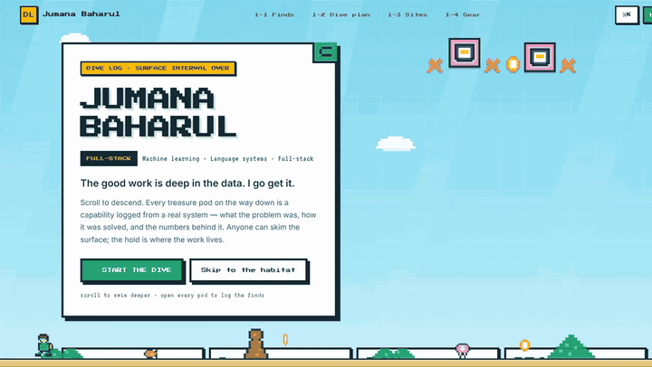

<h1 align="center">
  
  JUMANA BAHARUL
</h1>

  <b>AI engineer</b> · building language-model systems that have to be <i>right</i> 
  grounded in live data · constrained where it matters · honest when they don't know

  <a href="https://github.com/JumanaBaharul/portfolio"><b>▷ THE DIVE LOG</b></a>
  · <a href="https://linkedin.com/in/jumana-baharul/">LinkedIn</a>
  · <a href="https://leetcode.com/u/Jumana_Baharul/">LeetCode</a>
  · <a href="mailto:jumanabaharul@gmail.com">jumanabaharul@gmail.com</a>

 

  

  ▲ <b>My portfolio is a playable dive.</b> Scroll = depth: sunlit surface → twilight → midnight → abyss → hadal. 
  Every sprite drawn in code · glowing fauna · zone title cards · a dive-computer HUD · synthesized chiptune. <a href="https://github.com/JumanaBaharul/portfolio">Zero game assets.</a>

 

## If it can't say "I don't know", it isn't done.

That's the bar I build to. I build production assistants that answer operational
questions **strictly from live data** — a provider-agnostic LLM layer spanning
8 providers behind one client (automatic failover, per-call cost & latency
telemetry), and every generated answer cross-validated against live database
results before a human ever sees it.

 

<table>
<tr><td valign="top" width="50%">

### Selected work

| | |
|---|---|
| **Grounded ops assistant** | production AI for factory operations — 8 LLM providers behind one client, zero hallucinated numbers |
| **[AgroScan](https://github.com/JumanaBaharul/AgroScan)** | ConvLSTM2D over 12-timestep multispectral imagery → drone-ready GPS spray routes (A* · TSP · SA) |
| **[InjuryLens](https://github.com/deepuzz11/InjuryLens)** | 33-landmark pose estimation → 6 biomechanical risk metrics + a coach that cites the CV output |
| **[CredCheck](https://github.com/deepuzz11/CredCheck)** | 9 independent trust signals fused honestly — deterministic scorer under an LLM explainer |
| **[ford-ai-system](https://github.com/JumanaBaharul/ford-ai-system)** | RAG that refuses: exact vector search, T=0, four layers between you and a confident wrong answer |

</td><td valign="top" width="50%">

### How I think about LLM systems

**The model is not the product.** Retrieval, validation and guardrails are —
models write, the code decides.

**Ground everything, or refuse.** A system that admits uncertainty beats one
that sounds confident.

**Keep arithmetic out of the model's hands.** Pricing, safety thresholds and
validation belong where a model cannot reach them.

**Ship the unglamorous half.** Caching, cost telemetry, CI gates — the parts
nobody demos are why the demoed parts survive production.

</td></tr>
</table>

 

## Toolbox

`Python` `TypeScript` `SQL` · `PyTorch` `TensorFlow` `Keras` `scikit-learn` `Hugging Face` `RAG` `Whisper` `MediaPipe` · `FastAPI` `React` `Next.js` `Node.js` · `MongoDB` `PostgreSQL` `Supabase` `Prisma` · `Docker` `GitHub Actions` `Playwright`

 

  
&nbsp;
  
&nbsp;
  
&nbsp;
  

  <b>Available for the next descent.</b> If your data is messy, the answer has to be trustworthy, and someone will actually use the result — write to me. I answer every message.

